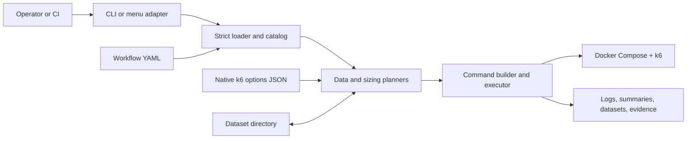

# Punch — Reference Architecture and Implementation Guide

What Punch is, why it is built this way, and how to reproduce its core in a
restricted environment without importing Punch. Source and tests (end of page)
stay authoritative. Layer ownership: [punch-boundaries.md](punch-boundaries.md).
Evidence contract: [validation.md](../workflows/validation.md).

## 1. Solution

Punch turns one declarative workflow file into one controlled Docker Compose
run of k6. It owns the policy Compose and k6 do not:

- strict workflow and native k6-config loading;
- catalog-wide producer/consumer validation for datasets;
- data-source planning and producer switching;
- workflow and load options selected independently;
- producer sizing from a downstream workflow's demand;
- allow-listed environment, argument-vector command, separate streams;
- atomic dataset publication, bounded cancellation, run evidence.

Out of scope: provisioning the system under test, business scenarios,
distributed fleets, secrets, and k6 threshold evaluation.



Python is the control plane; Compose and k6 are the execution plane; approved
report, log, state, and data directories are the artifact plane. Scenarios
know nothing about orchestration.

| Component           | Module                                         | Owns                                                       |
| ------------------- | ---------------------------------------------- | ---------------------------------------------------------- |
| CLI / assembly root | [`__main__.py`](../../src/punch/__main__.py)   | Arguments, sequencing, exit codes, `punch-run.json`        |
| Menu adapter        | [`menu.py`](../../src/punch/menu.py)           | Terminal discovery, choices, confirmation                  |
| Loader              | [`workflow.py`](../../src/punch/workflow.py)   | Immutable models, strict YAML/JSON, path containment       |
| Catalog             | [`catalog.py`](../../src/punch/catalog.py)     | Cross-workflow dataset links and lookups                   |
| Data planner        | [`data_plan.py`](../../src/punch/data_plan.py) | Source choice and producer switching (pure)                |
| Sizing planner      | [`sizing.py`](../../src/punch/sizing.py)       | Demand normalization, sizing math, generated config (pure) |
| Executor            | [`execution.py`](../../src/punch/execution.py) | Command vector, preflight, child lifecycle, datasets       |

Adapters depend on engine modules; engine modules never import presentation.

## 2. Core contracts

**Workflow** (`apiVersion: punch/v1`, `kind: K6Workflow`). Declarative facts
only; unknown or duplicate keys, invalid names, missing files, and paths
escaping `workingDirectory` fail at load:

```yaml
spec:
  workingDirectory: ../..
  compose: { file: docker-compose.yml, service: k6 }
  k6: { script: /scripts/orders.js, config: options/5-iterations.json }
  environment: { forward: [BASE_URL], required: [BASE_URL] }
  outputs: { summary: { path: reports/orders-summary.json } }
  data:
    directory: data
    mountedAt: /scripts/data
    produces: [{ dataset: orders, columns: [orderId], targets: [order-status] }]
    requires: [] # must exist with rows before Docker starts
    optional: [] # used only when present
  sizing: { iterationSeconds: 1.1, maxSeconds: 270, margin: 0.15 }
```

**Options.** A native k6 JSON object passed as `k6 run --config`, mounted
read-only at `/punch/k6-config.json`. A one-run `--config` replaces
`spec.k6.config`. k6 lets script options override the config, so scenarios
must not export `scenarios`, `vus`, `iterations`, `duration`, or `stages`.

**Datasets.** A name plus a fixed ordered column list. The catalog checks both
directions before any run: targets exist and consume the dataset, every
required dataset has a producer, all producers agree on columns. Producers
print `[DATA <dataset>] <csv-row>` on stdout; consumers receive
`DATA_<DATASET>_CSV=<container path>`.

**Results.** Planning and execution stay separate types:

| Type              | Holds                                                             |
| ----------------- | ----------------------------------------------------------------- |
| `DataPlan`        | Workflow that will actually run, chosen sources, any switch       |
| `SizingPlan`      | Target demand, margin, producer iterations/VUs, generated config  |
| `ExecutionResult` | Command, child exit code or preflight failure, dataset row counts |

A preflight failure has no child exit code; a child failure keeps its code.

## 3. Execution semantics

- **One workflow, one Compose run** (`run --rm`). `punch run all` runs
  workflows sequentially; chains stay operator- or CI-controlled.
- **Preflight before Docker:** required environment, required data, valid
  `--produce`, output-path collisions.
- **Streams:** stdout and stderr read concurrently into separate logs; only
  tagged stdout lines are data.
- **Publication:** opt-in (`--produce <dataset>`). Rows are column-checked into
  a same-directory temp file and atomically replace the target only after a
  successful run with ≥ 1 valid row; otherwise the previous file survives.
- **Cancellation:** the child runs in its own process group; Punch first sends
  `SIGINT` to the container (`docker kill --signal=SIGINT`) so k6 can write its
  summary, then terminates and reaps within bounded time.
- **Data planning (TTY):** settle optional datasets, then for a missing
  required dataset offer catalog producers (recommended one preselected). Picking one
  switches the run to that producer, still one Compose run; Punch then names
  the consumer to run next. `--no-input` skips the pickers.
- **Evidence:** `punch run` writes `reports/state/punch-run.json` (workflow,
  config identity, data sources, sizing, results, timing, exit code). The menu
  reports to the terminal only. Old CSV/HTML/JSON files are not current-run
  evidence.

## 4. Options versus size-for-target

| Question         | Options selection               | Size for a target (`--size-for`)      |
| ---------------- | ------------------------------- | ------------------------------------- |
| Intent           | Load shape for the selected run | Enough rows for a later consumer      |
| Config read      | Selected workflow's config      | Target's config (demand input)        |
| Config executed  | That JSON as-is                 | Generated producer config             |
| Workflow run     | Selected workflow               | Producer only; target never runs      |
| Datasets written | Operator's `--produce` choice   | Linked target datasets, automatically |

Sizing math (exact `Fraction` arithmetic; one row per iteration):

```text
shared-iterations:  Y = iterations
per-vu-iterations:  Y = vus × iterations
constant-vus:       Y = ceil(vus × durationSeconds / targetIterationSeconds)

producer iterations N = ceil(Y × (1 + targetMargin))
producer VUs        V = min(N, max(1, ceil(N × producerIterationSeconds / producerMaxSeconds)))
```

The producer runs a copy of its own config rewritten to `shared-iterations`
with `N` and `V`, keeping executor-independent scenario keys. Other executors,
staged or multi-scenario shapes, and missing sizing inputs fail before Docker.
Punch warns when produced rows fall short of `Y`.

## 5. Design decisions

| Decision                    | Why                                                  | Cost or limit                                        |
| --------------------------- | ---------------------------------------------------- | ---------------------------------------------------- |
| Declarative YAML workflows  | Workloads reviewable, consumer-owned; engine generic | Strict schema and migration discipline               |
| Native k6 JSON configs      | No second load model; configs work outside Punch     | Script options can override; needs contract tests    |
| Compose-mediated execution  | Reproducible toolchain; no host k6/Node              | Docker required; heavier startup                     |
| One workflow per run        | Clear cancellation, exit codes, evidence             | Multi-step chains need repeated runs or a scheduler  |
| Filesystem catalog/datasets | Offline, inspectable, portable                       | No concurrent-writer coordination or history         |
| Pure planners               | CLI, menu, tests share one policy                    | Assembly root must keep UI out of planners           |
| Tagged stdout + atomic swap | No data service; no partial publication              | Producers follow the line protocol; low volume only  |
| Environment allow-list      | Limits secret leakage                                | Authors maintain forwarded/required names            |
| Generated sizing config     | Reproducible demand; target untouched                | Single-shape policies; assumes one row per iteration |

## 6. Reproduce independently

Build vertical slices in order; each is usable and tested before the next.
Use neutral sample workflows; keep business URLs, credentials, and data out.

| #   | Slice                 | Build                                                                                             | Accept when                                                           |
| --- | --------------------- | ------------------------------------------------------------------------------------------------- | --------------------------------------------------------------------- |
| 1   | Contracts and loader  | Immutable models, versioned schema, native-config validation, typed results, exit codes           | Bad keys, names, refs, absolute or escaping paths fail before any run |
| 2   | Catalog               | Sorted discovery; lookups: workflow, producers, recommended producer, sizing pairs                | Broken links and column mismatches fail at catalog load               |
| 3   | Pure planners         | Data-source/producer switch as a state transition with a choice callback; sizing math             | Same inputs → same plan in CLI, menu, CI, tests; cycles fail typed    |
| 4   | Executor              | Argument vector, preflight, one child, concurrent streams, bounded interrupt; injectable launcher | No shell; undeclared env absent; preflight failure starts no child    |
| 5   | Dataset exchange      | Opt-in, tagged stdout only, CSV shape check, temp file beside destination, atomic swap            | Failed, empty, or malformed runs never replace valid data             |
| 6   | Adapters and evidence | Non-interactive CLI first, then a menu over the same APIs; redacted evidence record               | Child exit codes survive; evidence correlates with logs               |
| 7   | Restricted packaging  | Pinned dependencies and image digests, SBOM, checksums, schemas, offline install guide            | Install and contract suite pass with network disabled                 |

## 7. Restricted-environment hardening

- Verify dependency and image digests; fail on undeclared network access.
- Treat descriptors as code: safe YAML loading, pinned schema version, review.
- Resolve every read, mount, and write beneath an approved root.
- Never evaluate a shell string; never interpolate descriptor values.
- Secrets come from the enterprise secret mechanism, never descriptors,
  presets, command previews, logs, or evidence.
- Runner: dedicated identity, read-only inputs, bounded writable mounts,
  resource/time limits, network limited to the system under test.
- Synthetic data by default; classify, encrypt, retain, delete per policy.
- Redact evidence; integrity-protect it when it backs audit decisions.
- Interactive confirmation is usability, not authorization; CI uses
  pre-authorized identities and policy gates.

## 8. Source of truth

| Concern                              | Source                                         | Proof                                                                                                                          |
| ------------------------------------ | ---------------------------------------------- | ------------------------------------------------------------------------------------------------------------------------------ |
| Schema and path containment          | [`workflow.py`](../../src/punch/workflow.py)   | [`test_workflow.py`](../../tests/test_workflow.py)                                                                             |
| Catalog links                        | [`catalog.py`](../../src/punch/catalog.py)     | [`test_catalog.py`](../../tests/test_catalog.py)                                                                               |
| Data planning and switching          | [`data_plan.py`](../../src/punch/data_plan.py) | [`test_data_plan.py`](../../tests/test_data_plan.py)                                                                           |
| Command, streams, data, cancellation | [`execution.py`](../../src/punch/execution.py) | [`test_execution.py`](../../tests/test_execution.py)                                                                           |
| Sizing and generated config          | [`sizing.py`](../../src/punch/sizing.py)       | [`test_sizing.py`](../../tests/test_sizing.py)                                                                                 |
| Interactive selection                | [`menu.py`](../../src/punch/menu.py)           | [`test_menu.py`](../../tests/test_menu.py)                                                                                     |
| CLI sequencing and evidence          | [`__main__.py`](../../src/punch/__main__.py)   | [`test_cli.py`](../../tests/test_cli.py)                                                                                       |
| End-to-end contracts                 | —                                              | [`test_ci_contract.py`](../../tests/test_ci_contract.py), [`test_workflow_coverage.py`](../../tests/test_workflow_coverage.py) |

When prose and tested behavior disagree, fix the prose or make an explicit,
tested contract change.
