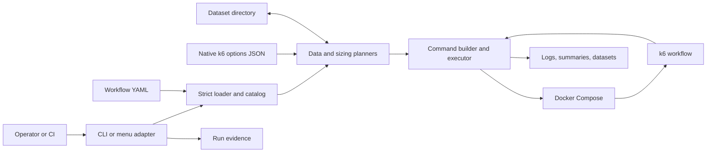
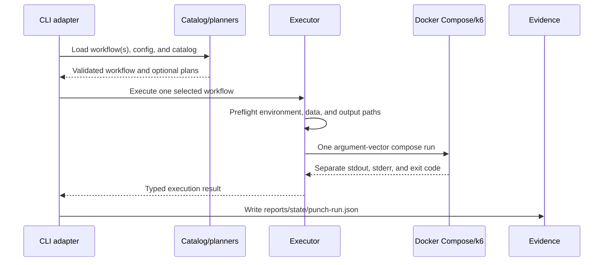

# Punch — Reference Architecture and Implementation Guide

This guide explains Punch as a reusable performance-workflow orchestrator and
shows how to reproduce its core behavior independently in a restricted
enterprise environment. It is descriptive, not a requirement to import Punch or
copy this repository. The implementation and contract tests linked at the end
remain the source of truth.

Use [Punch — Architectural Boundaries](punch-boundaries.md) for layer ownership
and [Workflow Validation](../workflows/validation.md) for the current evidence
contract.

## Purpose and scope

Punch turns declarative workflow files into one controlled Docker Compose run. It
adds the policy that Compose and k6 intentionally do not own:

- strict workflow and native k6-config loading;
- catalog-wide validation of dataset producers and consumers;
- interactive or non-interactive data-source planning;
- independent selection of a workflow and its load options;
- producer sizing from a downstream workflow's expected demand;
- allow-listed environment forwarding and deterministic command construction;
- separate stdout/stderr handling, atomic dataset publication, and cancellation;
- machine-readable evidence for `punch run`.

Punch does not provision the system under test, define business scenarios,
schedule a distributed fleet, manage enterprise secrets, or replace k6 threshold
evaluation. Those concerns stay outside the engine.

## System view



The Python process is the control plane. Compose and k6 are the execution plane.
Files under the approved reports, state, logs, and data directories are the
artifact plane. Keeping these planes separate makes the engine portable and
keeps workload code unaware of orchestration.

### Component ownership

| Component                 | Reference module                                         | Owns                                                                 |
| ------------------------- | -------------------------------------------------------- | -------------------------------------------------------------------- |
| Assembly root and CLI     | [`src/punch/__main__.py`](../../src/punch/__main__.py)   | Argument parsing, top-level sequencing, exit codes, `punch-run.json` |
| Interactive adapter       | [`src/punch/menu.py`](../../src/punch/menu.py)           | Terminal discovery, choices, confirmation, presentation              |
| Workflow model and loader | [`src/punch/workflow.py`](../../src/punch/workflow.py)   | Immutable contracts, strict YAML/JSON validation, path containment   |
| Catalog                   | [`src/punch/catalog.py`](../../src/punch/catalog.py)     | Cross-workflow producer/consumer validation and lookup               |
| Data planner              | [`src/punch/data_plan.py`](../../src/punch/data_plan.py) | Pure, UI-independent source choice and producer switching            |
| Sizing planner            | [`src/punch/sizing.py`](../../src/punch/sizing.py)       | Demand normalization, sizing math, generated producer config         |
| Executor                  | [`src/punch/execution.py`](../../src/punch/execution.py) | Command vectors, preflight, child lifecycle, streams, datasets       |

The adapters depend on the engine modules. Engine modules do not import terminal
presentation. A clean-room implementation should preserve this dependency
direction even if it uses another language or container runner.

## Core contracts

### Workflow

`K6Workflow` is the normalized, immutable execution contract. It identifies the
working directory, Compose file and service, k6 script, optional default config,
environment allow-list, required environment, summary outputs, datasets, and
sizing inputs.

The loader rejects malformed or ambiguous input before Docker starts, including
unknown keys, duplicate YAML keys, unsupported YAML features, invalid names,
missing referenced files, and paths escaping the workflow's working directory.
Catalog loading then validates relationships that one file cannot validate:

- workflow names are unique;
- every declared dataset target exists and consumes that dataset;
- every required dataset has at least one producer;
- all producers of one dataset use the same ordered columns.

### Plans and results

Keep planning data separate from execution data:

| Contract          | Meaning                                                                                             |
| ----------------- | --------------------------------------------------------------------------------------------------- |
| `DataPlan`        | The workflow that will actually run, selected data sources, output dataset, and any workflow switch |
| `SizingPlan`      | Target demand, margin, producer iterations/VUs, affected datasets, and generated config             |
| `ExecutionResult` | Planned command, child exit code, pass/fail reason, and dataset publication results                 |

A preflight failure has no child exit code because no process started. A child
failure preserves the child's code. This distinction is useful to automation and
should not be collapsed into a single Boolean.

## Execution paths

### Direct `punch run`



For one workflow in a terminal, the CLI may first invoke the shared data planner.
For `all`, it executes workflows sequentially and can keep going after failures.
Validation and path-collision failures happen before the container starts.

The interactive `punch menu` calls the same loaders, planners, command builder,
and executor. It adds terminal presentation and confirmation. It currently reports
the result to the terminal but does not write the `punch run` evidence file; an
independent implementation may unify that behavior if it treats the evidence
contract as a deliberate compatibility choice.

### Data planning and producer switching

The planner receives a picker callback rather than owning terminal UI. It first
settles each optional dataset: use scenario defaults or an available file. It then
checks required inputs. When a required dataset is empty, it offers catalog-known
producers and marks the recommended producer and missing environment variables.

Choosing a producer changes the workflow that will execute. Punch walks that
producer's own data requirements, detects cycles, opts into the requested output,
and still performs exactly one Compose run. After success, it tells the operator
which original consumer to run next. Punch is therefore a guided single-step
orchestrator, not a DAG executor.

### Options selection versus target-workflow selection

These choices look similar in a menu but have different inputs and effects:

| Question           | Normal options selection                           | Size for a target workflow                                       |
| ------------------ | -------------------------------------------------- | ---------------------------------------------------------------- |
| Intent             | Choose the load shape for the selected workflow    | Produce enough rows for a later consumer                         |
| Config read        | Selected workflow's default or chosen options JSON | Target workflow's default or chosen options JSON                 |
| Config executed    | The selected JSON as-is                            | A generated config for the producer                              |
| Workflow executed  | Selected workflow                                  | Producer workflow                                                |
| Target executed    | Not applicable                                     | Never                                                            |
| Dataset production | Optional operator choice                           | Required for linked target datasets                              |
| Failure conditions | Invalid config or path                             | Invalid link, unsupported target shape, or missing sizing inputs |

Normal selection passes a native k6 JSON object through `k6 run --config`. It does
not reinterpret the load model. A one-run `--config` overrides the workflow
default.

Sizing instead treats the target config as demand input. For one-row-per-iteration
producers, Punch normalizes supported target shapes into rows `Y`:

```text
shared-iterations:  Y = iterations
per-vu-iterations:  Y = vus * iterations
constant-vus:       Y = ceil(vus * durationSeconds / targetIterationSeconds)

producer iterations N = ceil(Y * (1 + targetMargin))
producer VUs        V = min(N, max(1,
                         ceil(N * producerIterationSeconds / producerMaxSeconds)))
```

Punch writes a producer config with `shared-iterations`, `N` iterations, and `V`
VUs while retaining compatible scenario metadata. The resulting producer—not the
target—is run once. This separation avoids surprising side effects and makes the
calculation testable without Docker.

## Execution and artifact invariants

The executor enforces the following behavior:

1. Build an argument vector; never evaluate a shell command string.
2. Forward only environment names declared by the workflow, plus generated data
   path variables.
3. Mount the resolved config read-only and run one Compose service with `--rm`.
4. Reject missing required data, environment, invalid production requests, and
   output-path collisions before starting Docker.
5. Read stdout and stderr concurrently. Only tagged stdout records of the form
   `[DATA <dataset>] <csv-row>` are eligible dataset data.
6. Validate field counts and buffer outputs in same-directory temporary files.
   Publish only after the whole run succeeds; otherwise preserve the previous
   dataset.
7. Run the child in its own process group. On interruption, first ask the named
   container to deliver `SIGINT` so k6 can emit summaries, then terminate and reap
   the process group within bounded time.

`punch run` records the selected workflow, resolved config identity, data sources,
sizing evidence, execution results, timing, and overall exit code in
`reports/state/punch-run.json`. Logs and current evidence, not the mere presence of
old datasets or reports, prove what happened in the current invocation.

## Design decisions and trade-offs

| Decision                          | Why                                                                     | Cost or limit                                                                     |
| --------------------------------- | ----------------------------------------------------------------------- | --------------------------------------------------------------------------------- |
| Declarative YAML workflows        | Workloads stay reviewable and consumer-owned                            | A strict schema and migration discipline are required                             |
| Native k6 JSON configs            | No parallel load-model abstraction; configs remain usable outside Punch | k6 script-defined options can override config fields and need contract tests      |
| Compose-mediated execution        | Reproducible network and toolchain without host k6/Node                 | Docker and Compose are required; startup is heavier than a host process           |
| One workflow per run              | Simple cancellation, evidence, and failure semantics                    | Multi-step pipelines require an external scheduler or repeated invocations        |
| Filesystem catalog and datasets   | Offline-friendly, inspectable, easy to transfer                         | No concurrent writer coordination or central history                              |
| Pure planning functions           | CLI, menu, and tests share policy                                       | The assembly root must still keep presentation concerns out of planners           |
| Tagged stdout plus atomic replace | No extra data service and no partial publication                        | Producers must follow the line protocol; high-volume data needs another transport |
| Explicit environment allow-list   | Limits accidental secret leakage                                        | Descriptor authors must maintain required and forwarded names                     |
| Generated sizing config           | Target demand is reproducible and the target stays untouched            | Supports only declared, single-shape policies and assumes measurable row yield    |

## Independent implementation guide

Implement these vertical slices in order. Each slice should work without access to
this repository once its contracts and tests are defined.

### 1. Establish portable contracts

Define an immutable workflow model, a versioned descriptor schema, native runner
config validation, typed plan/result models, and documented exit codes. Use neutral
sample workflows; keep internal business URLs, credentials, and datasets out of the
implementation package.

Acceptance: invalid keys, duplicate keys/names, missing references, absolute paths,
and path escapes fail deterministically before any runner call.

### 2. Build the loader and catalog

Normalize each descriptor once and validate cross-workflow dataset links. Provide
queries for workflow lookup, producers of a dataset, the recommended producer, and
valid sizing target pairs. Sort discovery and diagnostic output for reproducibility.

Acceptance: broken producer/consumer links and column disagreements fail at catalog
load, not halfway through a run.

### 3. Add pure planning

Implement data-source resolution and producer switching as a state transition that
accepts a choice function. Separately normalize target load shapes and calculate a
sizing plan using exact arithmetic at rounding boundaries. Neither planner starts a
process or renders terminal UI.

Acceptance: the same inputs yield the same plan in CLI, menu, CI, and unit tests;
cycles and unsupported shapes return typed failures.

### 4. Build a deterministic executor

Generate a process argument vector from validated inputs. Preflight environment and
data, start one isolated child, read both streams concurrently, preserve the exit
code, and implement bounded interruption. Inject the process launcher in tests so
the core suite needs no Docker daemon.

Acceptance: no shell is invoked, undeclared environment values are absent, and a
preflight failure starts no child.

### 5. Add transactional dataset exchange

Make publication opt-in. Parse only declared, tagged stdout records; validate CSV
shape; write beside the destination; and replace all requested outputs only after a
successful run. Discard temporary files on failure, interruption, malformed output,
or zero acceptable rows.

Acceptance: failure cannot replace the last valid file, stderr is never harvested,
and path aliases with evidence or logs are rejected.

### 6. Add adapters and evidence

Build a non-interactive CLI first, then an optional menu over the same APIs. Emit a
redacted evidence record for success, preflight failure, launch failure, child
failure, and interruption. Decide explicitly whether interactive runs share the
same evidence contract.

Acceptance: cancellation happens before Docker, child exit codes survive the
adapter, and current evidence can be correlated with its logs.

### 7. Package for a restricted environment

Mirror and pin the language dependencies and Compose/k6 images. Export checksums,
an SBOM, licenses, schemas, neutral fixtures, and offline install/verification
instructions. The protected environment should supply its own workflows, runner
network policy, secrets, and synthetic or approved datasets.

Acceptance: install and the contract suite succeed with network access disabled.

## Enterprise hardening checklist

- Verify dependency and image digests; fail on undeclared network access.
- Review descriptors as executable configuration and require schema-version
  migration for breaking changes.
- Constrain every read, mount, and write to approved roots after resolving links.
- Run containers with a dedicated identity, read-only inputs, bounded writable
  mounts, resource/time limits, and an allow-listed network path to the target.
- Obtain secrets from the enterprise secret mechanism; never place values in
  descriptors, options, command previews, logs, or evidence.
- Use synthetic data by default and apply classification, encryption, retention,
  and deletion rules to datasets and artifacts.
- Redact sensitive URLs and values from evidence. Integrity-protect evidence used
  for audit or release decisions.
- Treat interactive confirmation as usability, not authorization; CI identities
  and policy gates provide authorization.

## Reproduction acceptance checklist

- A workflow and a normal options config can be selected independently.
- Sizing producer A for target B executes A once and never executes B.
- Every supported target shape matches the documented sizing formulas.
- Invalid descriptors, links, configs, paths, or required data start no child.
- Only declared environment names and generated dataset paths reach the container.
- Failed, empty, or malformed producer output cannot replace valid data.
- stdout and stderr remain distinct; logs retain both without harvesting stderr.
- Interrupts clean up the child and container without losing the k6 summary when it
  can be emitted.
- Evidence distinguishes preflight, launch, child, and orchestration failures.
- The full distribution installs and verifies offline.

## Source-of-truth map

These files demonstrate Punch's current behavior. They are references, not runtime
dependencies for an independent implementation.

| Concern                              | Source and proof                                                                                                                           |
| ------------------------------------ | ------------------------------------------------------------------------------------------------------------------------------------------ |
| Workflow schema and containment      | [`src/punch/workflow.py`](../../src/punch/workflow.py), [`tests/test_workflow.py`](../../tests/test_workflow.py)                           |
| Catalog relationships                | [`src/punch/catalog.py`](../../src/punch/catalog.py), [`tests/test_catalog.py`](../../tests/test_catalog.py)                               |
| Data planning and switching          | [`src/punch/data_plan.py`](../../src/punch/data_plan.py), [`tests/test_data_plan.py`](../../tests/test_data_plan.py)                       |
| Command, streams, data, cancellation | [`src/punch/execution.py`](../../src/punch/execution.py), [`tests/test_execution.py`](../../tests/test_execution.py)                       |
| Sizing formulas and generated config | [`src/punch/sizing.py`](../../src/punch/sizing.py), [`tests/test_sizing.py`](../../tests/test_sizing.py)                                   |
| Interactive selection                | [`src/punch/menu.py`](../../src/punch/menu.py), [`tests/test_menu.py`](../../tests/test_menu.py)                                           |
| CLI sequencing and evidence          | [`src/punch/__main__.py`](../../src/punch/__main__.py), [`tests/test_cli.py`](../../tests/test_cli.py)                                     |
| End-to-end contracts                 | [`tests/test_ci_contract.py`](../../tests/test_ci_contract.py), [`tests/test_workflow_coverage.py`](../../tests/test_workflow_coverage.py) |

When this document and tested behavior disagree, change the document or make an
explicit contract change with tests. Do not create a second implementation rule in
prose.
